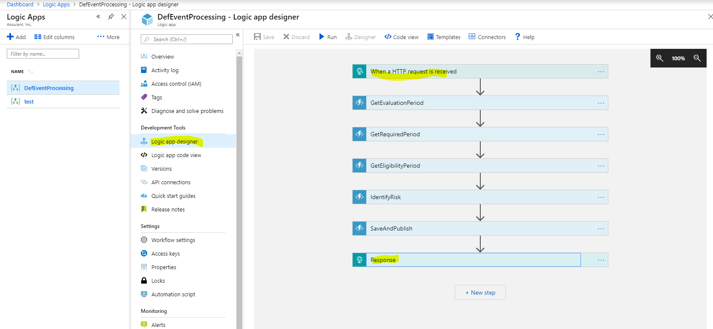
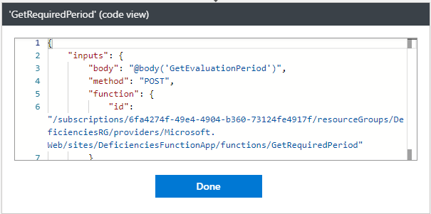

Azure Cloud Services

The cloud is changing the way applications are designed. Instead of monoliths,
applications are decomposed into smaller, decentralized services. These services
communicate through APIs or by using asynchronous messaging or eventing.
Applications scale horizontally, adding new instances, as demand requires.

These trends bring new challenges. Application state is distributed. Operations
are done in parallel and asynchronously. The system as a whole must be resilient
when failures occur. Deployments must be automated and predictable. Monitoring
and telemetry are critical for gaining insight into the system. The Azure
Application Architecture Guide is designed to help you navigate these changes.

Above paragraphs are taken from
<https://docs.microsoft.com/en-us/azure/architecture/guide/> , and if you
navigate through all the sections If find everything that you are looking for. I
also gave it a shot of directly reading those without basic knowledge of Azure
services and had a very hard time to frame a picture in my mind while reading
those. The biggest challenge was from where to start and how to get comfortable
with Azure Architecture Center.

Here I am trying to attempt to Use various Azure Service to shape it into
traditional Enterprise Architecture. The whole objective of this exercise is to
learn following Azure Service and design a high-level enterprise solution.

-   Azure Function
-   Function App
-   Service Bus
-   Logic App
-   Storage Service (table)

Scenario:

-   Console App publish an event to Topic **policyevent of** Service Bus.
-   Trigger Azure function **PolicyTopicReader** when a subscriber receives a message.
-   **PolicyTopicReader** call **App Logic** to start process this message.
-   Write the Risk Created to **Azure Storage (table)** and publish event back to Service Bus.


1.  **PolicyTopicReader** - Code to send Message to Topic:

```
using Microsoft.Azure.ServiceBus;
using System;
using System.Text;
using System.Threading.Tasks;

namespace WriteToTopic
{
    class Program
    {
        const string ServiceBusConnectionString = "Endpoint=sb://neuron.servicebus.windows.net/;SharedAccessKeyName=RootManageSharedAccessKey;SharedAccessKey=mLQjdI6B4U83mG9EFLDhw9t1COULHHLkkyyghZ1/PJg=";
        const string TopicName = "policyevent";
        static ITopicClient topicClient;

        static void Main(string[] args)
        {
            MainAsync().GetAwaiter().GetResult();

            Console.ReadKey();
        }

        static async Task MainAsync()
        {
            const int numberOfMessages = 10;
            topicClient = new TopicClient(ServiceBusConnectionString, TopicName);

            // Send messages.
            await SendMessagesAsync(numberOfMessages);
            await topicClient.CloseAsync();
        }

        static async Task SendMessagesAsync(int numberOfMessagesToSend)
        {
            try
            {
                // Create a new message to send to the topic
                string messageBody = @"{
                                        ""loanKey"": ""beb05058-8b0e-e811-80c7-0025b500b0db"",
                                        ""globalPropertyId"": 151042454,
                                        ""evaluationPeriod"": 
                                            {
                                            ""startDate"": ""2017-08-25"",
                                            ""endDate"": ""9999-12-31""
                                            }
                                        }";
                var message = new Message(Encoding.UTF8.GetBytes(messageBody));

                // Write the body of the message to the console
                Console.WriteLine($"Sending message: {messageBody}");

                // Send the message to the topic
                await topicClient.SendAsync(message);
            }
            catch (Exception exception)
            {
                Console.WriteLine($"{DateTime.Now} :: Exception: {exception.Message}");
            }
        }
    }
}
```
1.  Once message is sent it’s written to subscriber of **policyevent** Topic and
    can be navigated as below –


1.  On receipt of a message by this subscriber, it triggers
    **PolicyTopicReader** function.


```
using System;
using System.Threading.Tasks;
using System.Net.Http;
using System.Text;

private static string logicAppUri = \@"https://prod-25.centralus.logic.azure.com:443/workflows/571ed60873ff46cfa119cabaf2fc818c/triggers/manual/paths/invoke?api-version=2016-10-01\&sp=%2Ftriggers%2Fmanual%2Frun&sv=1.0&sig=bcU8napBOwEM78XGh-MkdypXcZCcRLPwismZGOIPRxQ";

public static void Run(string mySbMsg, ILogger log)
{
	log.LogInformation(\$"C\# ServiceBus topic trigger function processed message:{mySbMsg}");
	using (var client = new HttpClient())
	{
		var response = client.PostAsync(logicAppUri, new StringContent(mySbMsg,	Encoding.UTF8, "application/json")).Result;
	}
}
```

Important point to note here is CORS is configured to allow all (\*). This is under Platform feature of function app.


1.  This calls Logic App to process event message.





**GetEvaluationPeriod:**


```
\#r "Newtonsoft.Json"

using System;
using System.IO;
using System.Threading.Tasks;
using Microsoft.AspNetCore.Mvc;
using Microsoft.Azure.WebJobs;
using Microsoft.AspNetCore.Http;
using Microsoft.Extensions.Logging;
using Newtonsoft.Json;

public static async Task\<IActionResult\> Run(HttpRequest req, ILogger log)
{
	if (req == null) throw new ArgumentNullException(nameof(req));
	if (req.Body == null) throw new ArgumentNullException(nameof(req));
	string requestBody = await new StreamReader(req.Body).ReadToEndAsync();

	if (string.IsNullOrEmpty(requestBody)) throw new ArgumentNullException(nameof(requestBody));

	var evaluationRequest = JsonConvert.DeserializeObject\<EvaluationRequest\>(requestBody);

	if (evaluationRequest == null) throw new ArgumentNullException(nameof(evaluationRequest));

	if (evaluationRequest.EvaluationPeriod == null) throw new ArgumentNullException(nameof(evaluationRequest.EvaluationPeriod));

	// Add clamp logic to evaluation period

	evaluationRequest.EvaluationPeriod.StartDate = evaluationRequest.EvaluationPeriod.StartDate \< DateTime.Parse("02/10/2018")
	? DateTime.Parse("02/10/2018")
	: evaluationRequest.EvaluationPeriod.StartDate;
	return (ActionResult)new OkObjectResult(evaluationRequest);
}

public class EvaluationRequest
{
	public Guid LoanKey { get; set; }
	public int GlobalPropertyId { get; set; }
	public EvaluationPeriod EvaluationPeriod { get; set; }
}

public class EvaluationPeriod
{
	public DateTime StartDate { get; set; }
	public DateTime EndDate { get; set; }
}
```
**GetRequiredPeriod:**





```
\#r "Newtonsoft.Json"

using System;
using System.IO;
using System.Threading.Tasks;
using Microsoft.AspNetCore.Mvc;
using Microsoft.Azure.WebJobs;
using Microsoft.AspNetCore.Http;
using Microsoft.Extensions.Logging;
using Newtonsoft.Json;
using System.Collections;
using System.Collections.Generic;

public static async Task\<IActionResult\> Run(HttpRequest req, ILogger log)
{
	if (req == null) throw new ArgumentNullException(nameof(req));
	if (req.Body == null) throw new ArgumentNullException(nameof(req));
	string requestBody = await new StreamReader(req.Body).ReadToEndAsync();

	if (string.IsNullOrEmpty(requestBody)) throw new ArgumentNullException(nameof(requestBody));
	var evaluationRequest = JsonConvert.DeserializeObject\<EvaluationRequest\>(requestBody);
	if (evaluationRequest == null) throw new ArgumentNullException(nameof(evaluationRequest));
	if (evaluationRequest.EvaluationPeriod == null) throw new ArgumentNullException(nameof(evaluationRequest.EvaluationPeriod));

	return (ActionResult)new OkObjectResult(GetRequiredPeriods(evaluationRequest));
}

public static IEnumerable\<RequiredPeriod\> GetRequiredPeriods(EvaluationRequest evaluation)
	{
	return new RequiredPeriod[]
	{
		new RequiredPeriod(){ StartDate = evaluation.EvaluationPeriod.StartDate, EndDate = evaluation.EvaluationPeriod.EndDate, CvgType = CvgType.WI, Peril= Peril.Fire, RiskType = RiskType.Lapse},
		new RequiredPeriod(){ StartDate = evaluation.EvaluationPeriod.StartDate, EndDate = evaluation.EvaluationPeriod.EndDate, CvgType = CvgType.WI, Peril= Peril.Fire, RiskType = RiskType.Gap},
		new RequiredPeriod(){ StartDate = evaluation.EvaluationPeriod.StartDate, EndDate = evaluation.EvaluationPeriod.EndDate, CvgType = CvgType.SO, Peril= Peril.Fire, RiskType = RiskType.Lapse},
		new RequiredPeriod(){ StartDate = evaluation.EvaluationPeriod.StartDate, EndDate = evaluation.EvaluationPeriod.EndDate, CvgType = CvgType.SO, Peril= Peril.Fire, RiskType = RiskType.Gap},
	};
}

public class EvaluationRequest
{
	public Guid LoanKey { get; set; }
	public int GlobalPropertyId { get; set; }
	public EvaluationPeriod EvaluationPeriod { get; set; }
}

public class EvaluationPeriod
{
	public DateTime StartDate { get; set; }
	public DateTime EndDate { get; set; }
}

public class RequiredPeriod
{
	public Peril Peril { get; set; }
	public CvgType CvgType { get; set; }
	public RiskType RiskType { get; set; }
	public DateTime StartDate { get; set; }
	public DateTime EndDate { get; set; }
}

public enum Peril
{
	Fire = 1,
	Flood = 2,
	Wind = 3,
	Hurricane = 5
}

public enum RiskType
{
	Lapse = 1,
	Gap = 2
}

public enum CvgType
{
	WI = 1,
	SO = 2,
	ES = 3
}
```

**GetEligibilityPeriod:**


```
\#r "Newtonsoft.Json"

using System;
using System.Net;
using Microsoft.AspNetCore.Mvc;
using Microsoft.Extensions.Primitives;
using Newtonsoft.Json;

public static async Task\<IActionResult\> Run(HttpRequest req, ILogger log)
{
	if (req == null) throw new ArgumentNullException(nameof(req));
	if (req.Body == null) throw new ArgumentNullException(nameof(req));
	string requestBody = await new StreamReader(req.Body).ReadToEndAsync();

	if (string.IsNullOrEmpty(requestBody)) throw new ArgumentNullException(nameof(requestBody));
	var requiredPeriods = JsonConvert.DeserializeObject\<IEnumerable\<RequiredPeriod\>\>(requestBody);
	if (requiredPeriods == null) throw new	ArgumentNullException(nameof(requiredPeriods));
	return (ActionResult)new OkObjectResult(GetEligibilityPeriods(requiredPeriods));
}

public static IEnumerable\<EligibilityPeriod\> GetEligibilityPeriods(IEnumerable\<RequiredPeriod\> requiredPeriods)
{
	return requiredPeriods
	.Select(req =\> new EligibilityPeriod(){ StartDate = DateTime.Now, EndDate =
		DateTime.MaxValue, CvgType = CvgType.WI, Peril= Peril.Fire, RiskType =
		RiskType.Lapse})
	.ToList();
}

public class EvaluationRequest
{
	public Guid LoanKey { get; set; }
	public int GlobalPropertyId { get; set; }
	public EvaluationPeriod EvaluationPeriod { get; set; }
}

public class EvaluationPeriod
{
	public DateTime StartDate { get; set; }
	public DateTime EndDate { get; set; }
}

public class RequiredPeriod
{
	public Peril Peril { get; set; }
	public CvgType CvgType { get; set; }
	public RiskType RiskType { get; set; }
	public DateTime StartDate { get; set; }
	public DateTime EndDate { get; set; }
}

public class EligibilityPeriod
{
	public Peril Peril { get; set; }
	public CvgType CvgType { get; set; }
	public RiskType RiskType { get; set; }
	public DateTime StartDate { get; set; }
	public DateTime EndDate { get; set; }
}

public enum Peril
{
	Fire = 1,
	Flood = 2,
	Wind = 3,
	Hurricane = 5
}

public enum RiskType
{
	Lapse = 1,
	Gap = 2
}

public enum CvgType
{
	WI = 1,
	SO = 2,
	ES = 3
}
```
**IdentifyRisk:**


```
\#r "Newtonsoft.Json"

using System;
using System.Net;
using Microsoft.AspNetCore.Mvc;
using Microsoft.Extensions.Primitives;
using Newtonsoft.Json;

public static async Task\<IActionResult\> Run(HttpRequest req, ILogger log)
{
	if (req == null) throw new ArgumentNullException(nameof(req));
	if (req.Body == null) throw new ArgumentNullException(nameof(req));
	string requestBody = await new StreamReader(req.Body).ReadToEndAsync();
	if (string.IsNullOrEmpty(requestBody)) throw new ArgumentNullException(nameof(requestBody));
	var eligibilityPeriods = JsonConvert.DeserializeObject\<IEnumerable\<EligibilityPeriod\>\>(requestBody);
	if (eligibilityPeriods == null) throw new	ArgumentNullException(nameof(eligibilityPeriods));
	return (ActionResult)new OkObjectResult(GetLrps(eligibilityPeriods));
}

public static IEnumerable\<LenderRiskPeriod\> GetLrps(IEnumerable\<EligibilityPeriod\> eligibilityPeriods)
{
	return eligibilityPeriods
	.Select(e => new LenderRiskPeriod()
	{
		StartDate = e.StartDate,
		EndDate = e.EndDate,
		CvgType = e.CvgType,
		Peril = e.Peril,
		RiskType = e.RiskType,
		Amount = 100
	})
	.ToList();
}

public class LenderRiskPeriod
{
	public Peril Peril { get; set; }
	public CvgType CvgType { get; set; }
	public RiskType RiskType { get; set; }
	public DateTime StartDate { get; set; }
	public DateTime EndDate { get; set; }
	public int Amount { get; set; }
}

public class EligibilityPeriod
{
	public Peril Peril { get; set; }
	public CvgType CvgType { get; set; }
	public RiskType RiskType { get; set; }
	public DateTime StartDate { get; set; }
	public DateTime EndDate { get; set; }
}

public enum Peril
{
	Fire = 1,
	Flood = 2,
	Wind = 3,
	Hurricane = 5
}

public enum RiskType
{
	Lapse = 1,
	Gap = 2
}

public enum CvgType
{
	WI = 1,
	SO = 2,
	ES = 3
}
```

**SaveAndPublish:**


```
\#r "Newtonsoft.Json"

using System;
using System.Net;
using Microsoft.AspNetCore.Mvc;
using Microsoft.Extensions.Primitives;
using Newtonsoft.Json;

public static async Task\<IActionResult\> Run(HttpRequest req,ICollector\<LoanProperty\> tableBinding, ICollector\<string\> queueCollector, ILogger log)
{
	if (req == null) throw new ArgumentNullException(nameof(req));
	if (req.Body == null) throw new ArgumentNullException(nameof(req));
	string requestBody = await new StreamReader(req.Body).ReadToEndAsync();
	if (string.IsNullOrEmpty(requestBody)) throw new ArgumentNullException(nameof(requestBody));

	var lrps = JsonConvert.DeserializeObject\<IEnumerable\<LenderRiskPeriod\>\>(requestBody);
	if (lrps == null) throw new ArgumentNullException(nameof(lrps));
	log.LogInformation(\$"Adding LenderRiskPeriod");
	var riskProfile = JsonConvert.SerializeObject(lrps).ToString();
	tableBinding.Add(
		new LoanProperty() {
			PartitionKey = Guid.NewGuid().ToString(),
			RowKey = Guid.NewGuid().ToString(),
			ClientPortfolioId = 1,
			LoanKey = Guid.NewGuid().ToString(),
			GlobalPropertyId = 1,
			LenderRiskPeriod = riskProfile
		}
	);

	queueCollector.Add(riskProfile);
	return (ActionResult)new OkObjectResult(null);
}

public class LoanProperty
{
	public string PartitionKey { get; set; }
	public string RowKey { get; set; }
	public string LoanKey { get; set; }
	public int ClientPortfolioId { get; set; }
	public long GlobalPropertyId { get; set; }
	public string LenderRiskPeriod { get; set; }
}

public class LenderRiskPeriod
{
	public Peril Peril { get; set; }
	public CvgType CvgType { get; set; }
	public RiskType RiskType { get; set; }
	public DateTime StartDate { get; set; }
	public DateTime EndDate { get; set; }
	public int Amount { get; set; }
}

public enum Peril
{
	Fire = 1,
	Flood = 2,
	Wind = 3,
	Hurricane = 5
}

public enum RiskType
{
	Lapse = 1,
	Gap = 2
}

public enum CvgType
{
	WI = 1,
	SO = 2,
	ES = 3
}
```
**Response:**


1.  Verify the result in Azure Storage table.


1.  Verify the result in Service Bus.


Additional Notes:

1.  Below example shows how you can construct variable and assign values to that.


1.  Azure Service Abstraction hierarchy -

>   IaaS \> Azure Service Fabric \> App Service \> Logic app and Azure functions

1.  If you have created a VM and want to access using RDP, then you need to allow port 3389.
