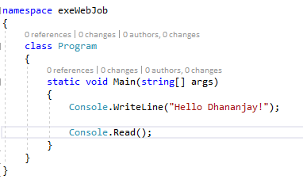
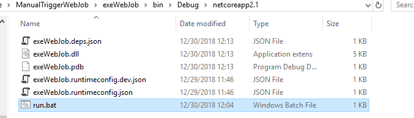
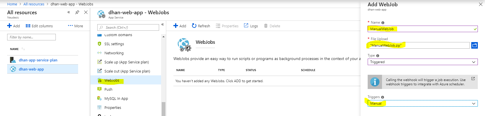
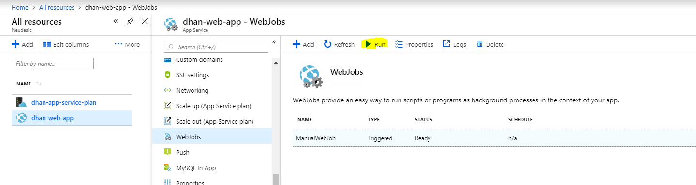
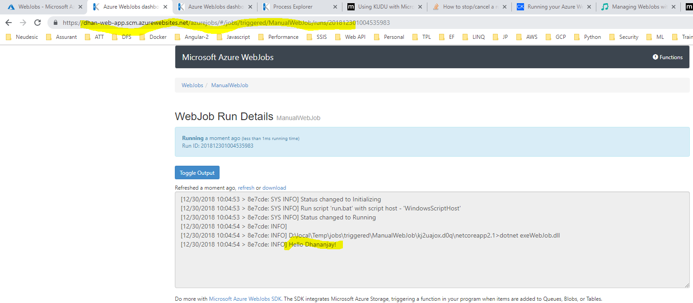
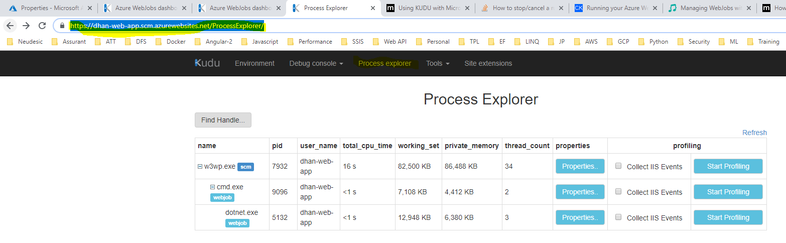
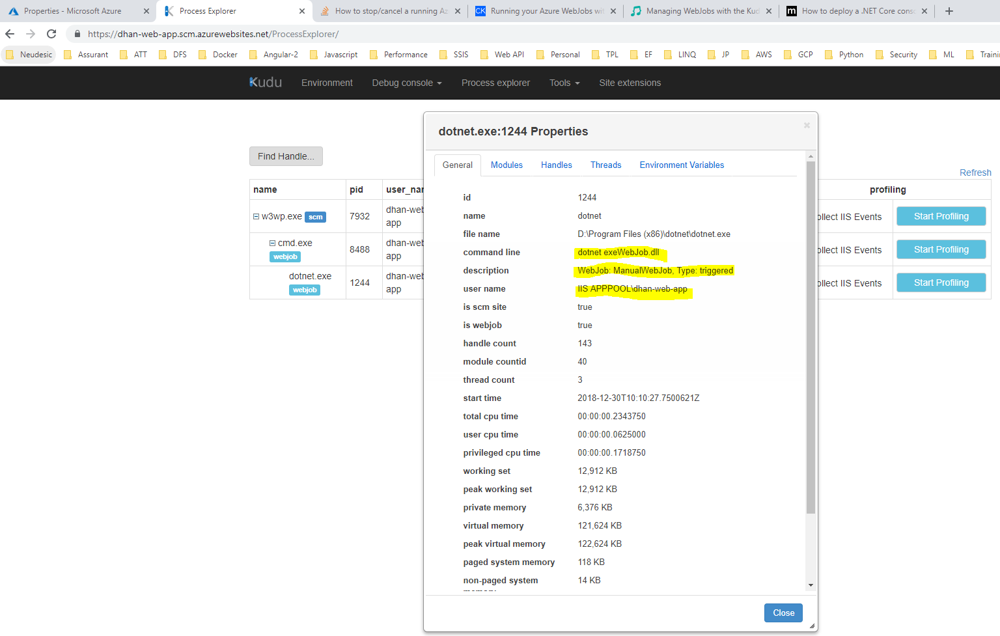
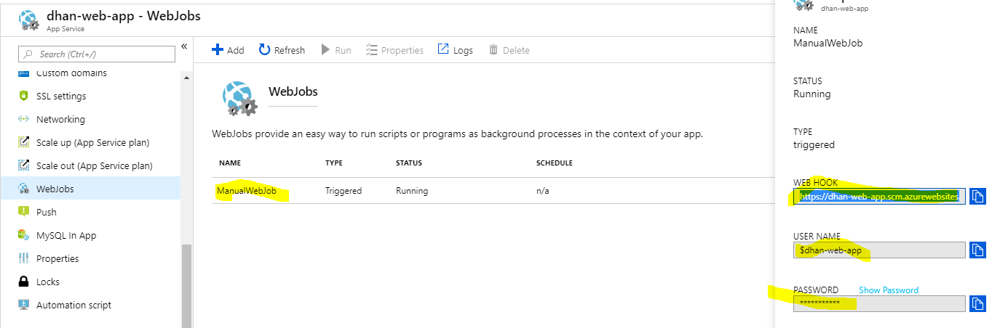
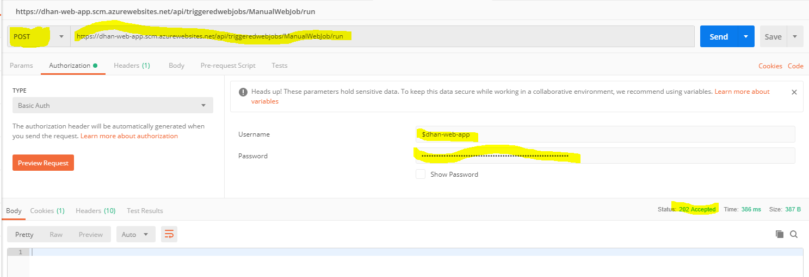
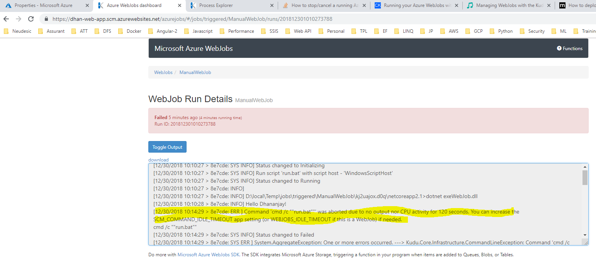

# Azure App Service – Web Job

The objective of this exercise is to learn following Azure App Service – Web
Job.

It provides ability to run a script (called job) in two different ways:

1.  Trigger - run the job every time an API is called or a schedule is reached.

2.  Continuous - make sure the job is always running (job should have a while
    loop but when it goes down we bring it back up).

Jobs are deployed by copying them to the right place in the file-system (or
using a designated API which will do the same). These Jobs will run under the
worker process of the SCM\\Kudu Web Site and not the main site.

**Running .NET Core Console App as WebJob -**

A WebJob looks for specific file type, for example (.cmd, .bat, .exe, etc). To
run a .NET Core console application use the DOTNET command. Therefore, you need
to create a file with an extension a WebJob is looking for that executes, for
example: **dotnet exeWebJob.dll** for my example I named it **run.bat**. 

To deploy the .NET Core console application to an Azure App Service Web App Web
Job access the Azure portal and navigate to the Azure App Service where you will
host the WebJob.  Then click on the WebJobs link and the Add button.

Once the WebJob is successfully uploaded, it will render in the WebJob blade. 
Click on it and you will see the Run button. As this WebJob is a manually
triggered job, you must click on the Run button in order for the job logic
within the .NET Core console application to run.

When you write output to the console using the WriteLine() method, it will show
in the Run Details window on KUDU/SCM.  After starting the .NET Core WebJob,
click on the Logs link and a new browser tab is opened and you can see the most
current state of the WebJob.

Lastly, you can see that the .NET Core WebJob is running within the DOTNET.EXE
process by looking at the Process explorer in KUDU/SCM.  Click on the Properties
button to view the command line.

Invoking from postman –

**Note:**

1.  In case of any failure, you can see Run Details for the reason of failure.

1.  WebJob Working Directory - There are 2 options for where the WebJob is
    running from (what is the working directory):

2.  The WebJob is copied to a temporary directory under %TEMP%\\jobs\\{job
    type}\\{job name}\\{random name} and will run from there This option
    prevents the original WebJob binaries from being locked which might cause
    issues redeploying the WebJob. For example updating an .exe file that is
    currently running.

3.  The WebJob is run directly from the WebJob binaries directory. We call this
    option **in place**. This option can have the locking issue and should only
    be used when there is no risk of locking the file. For example if the WebJob
    only consists of a .cmd file.

>   By default the first option is used (in place = false) other than
>   for .js node.js scripts (in place = true).

1.  The **Azure WebJobs SDK** is a framework that simplifies the task of writing
    background processing code that accesses data in Azure services. The SDK
    features a declarative syntax for specifying events that should trigger a
    function, such as a new message added to a queue. Similar declarative syntax
    controls reading and writing data once a function has been triggered. This
    system of triggers and bindings takes care of most of the low-level coding
    tasks associated with accessing Azure and third-party services.

### Functions, triggers and bindings

A WebJobs SDK project defines one or more *functions*. A function is a method
that has a trigger attribute in its method signature. Triggers specify
conditions for calling a function, and bindings specify what to read and write.
For example, the trigger attribute in the following function tells the runtime
to call the function whenever a queue message appears in the items queue.
The Blob attribute tells the runtime to use the queue message to read a blob in
the *workitems* container. The content of the queue message — provided in
the queueTrigger parameter — is the name of the blob.
